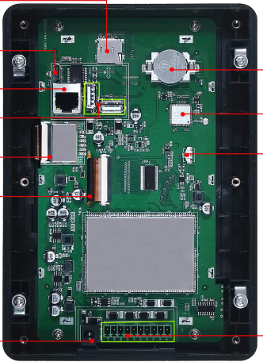
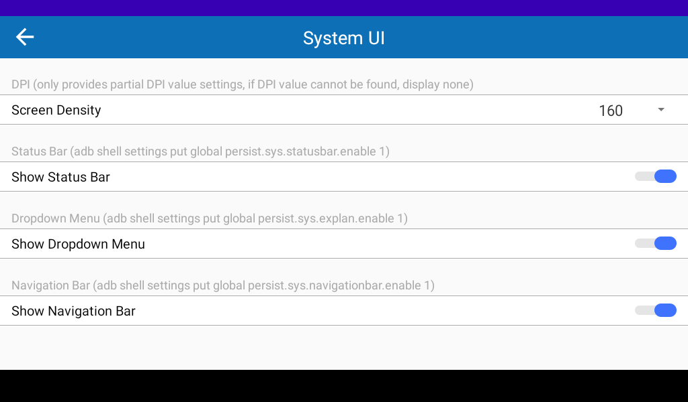
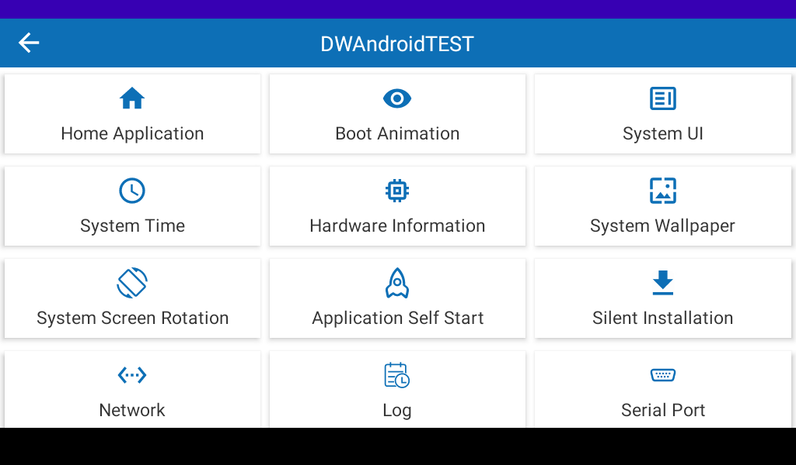
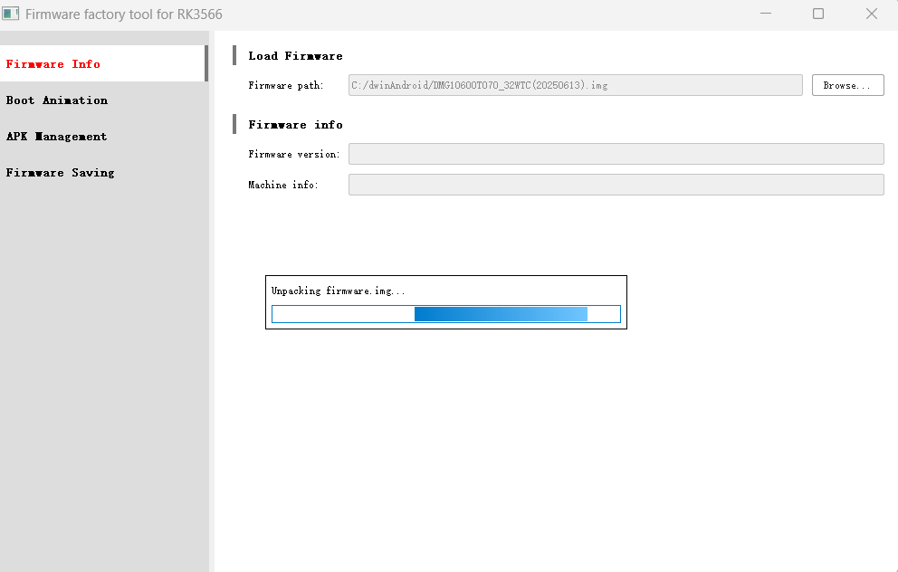
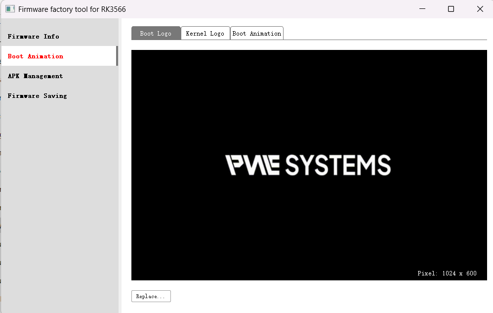
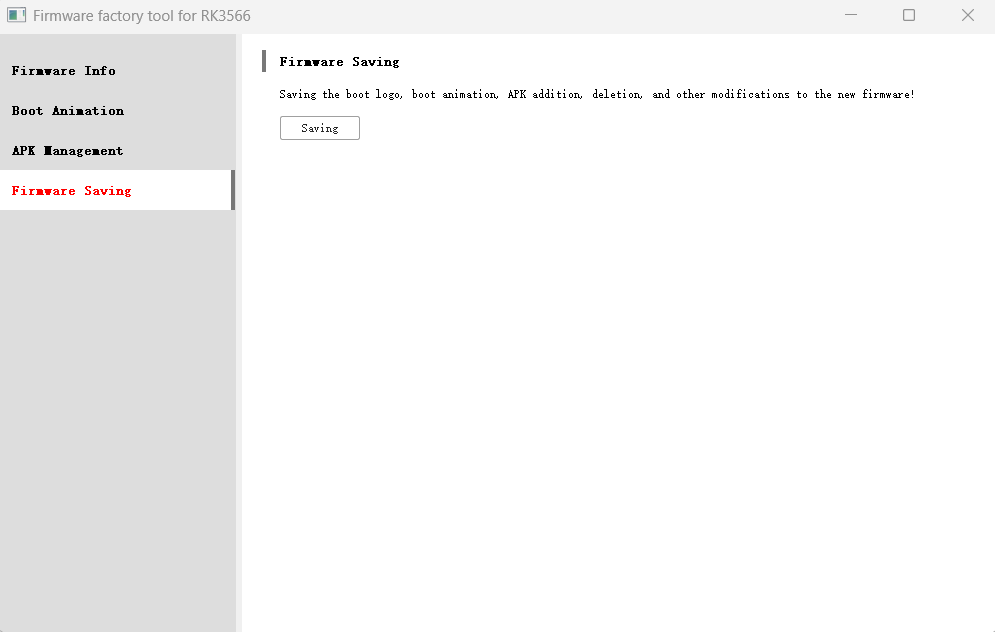
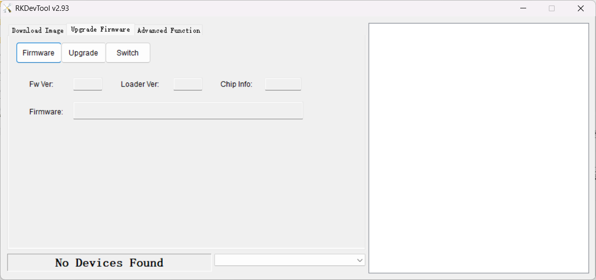
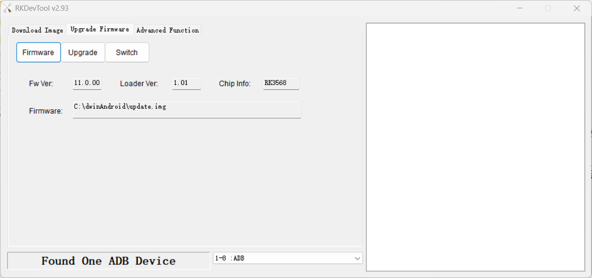
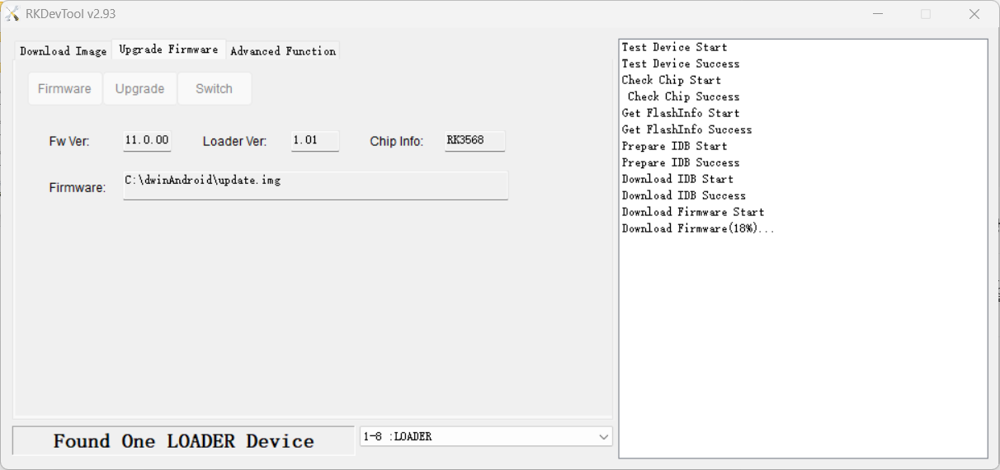

# DWIN 환경설정

## 개요

1. DPI, 상태바, 네비게이션바 설정 하기
2. BootImage 변경하기

---

## 1. DPI, 상태바, 네비게이션바 설정 하기

### 1) APK 설치 및 실행

1. DWIN 제공하는 APK 설치하기 (`dwin-common-release-20250725-V1.0.1.apk.1.apk.1.apk`)
2. DWAndroidTEST 실행 후 System UI 에서 설정 변경

### 2) APK 설치 과정

USB 드라이버에 `dwin-common-release-20250725-V1.0.1.apk.1.apk.1.apk` 파일을 넣고 모니터 파워(12V)를 넣는다.
해당 apk를 설치를 진행한다.

### 3) System UI 설정

해당 앱 실행 후 System UI 에서 DPI 설정 및 상태바 설정을 할 수 있다.

---

## 2. BootImage 변경하기

### 1) 준비 사항

1. DWIN Android OS (`DMG10600T070_32WTC(20250613).img`) 이미지를 준비한다.
2. FWFactoryTool_RK3566_v2.4 펌웨어를 부트이미지를 업데이트를 한다.
3. 해당 업데이트된 이미지를 RK3566-USB-Burning-Tool을 이용하여 모니터 업데이트 진행한다.

### 2) 펌웨어 툴 실행

FWFactoryTool_RK3566_v2.4 실행한다.
경로는 한글 경로가 있으면 안된다. – 최상위 폴더 위에서 설치 권고

### 3) 이미지 교체 및 로고 수정

해당 Replace 이용하여 변경 이미지를 설정한다.
커널 Logo 를 수정해준다.
크기는 화면 해상도에 맞게 bmp 변경 및 파일명은 `Logo.bmp`로 설정해준다.

### 4) 이미지 저장

Saving 버튼을 눌러 img를 업데이트 해준다.

### 5) 디버깅 포트 연결

안드로이드 모니터 디버깅 포트에 USB-C 타입을 연결해준다음 전원을 켜준다.

### 6) 펌웨어 이미지 선택

Firmware 클릭 후 업데이트할 이미지 선택

### 7) ADB 디바이스 확인 및 로더 전환

아래 Found One ADB Device 확인 하면 Switch 클릭 하여 Loader Device 변경

### 8) 펌웨어 업데이트 진행

Upgrade 버튼을 눌러 펌웨어 업데이트 진행

