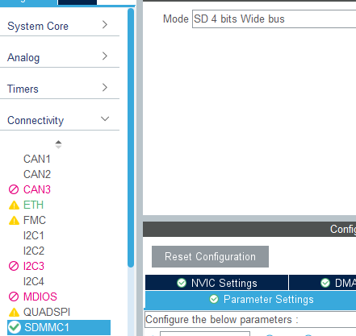
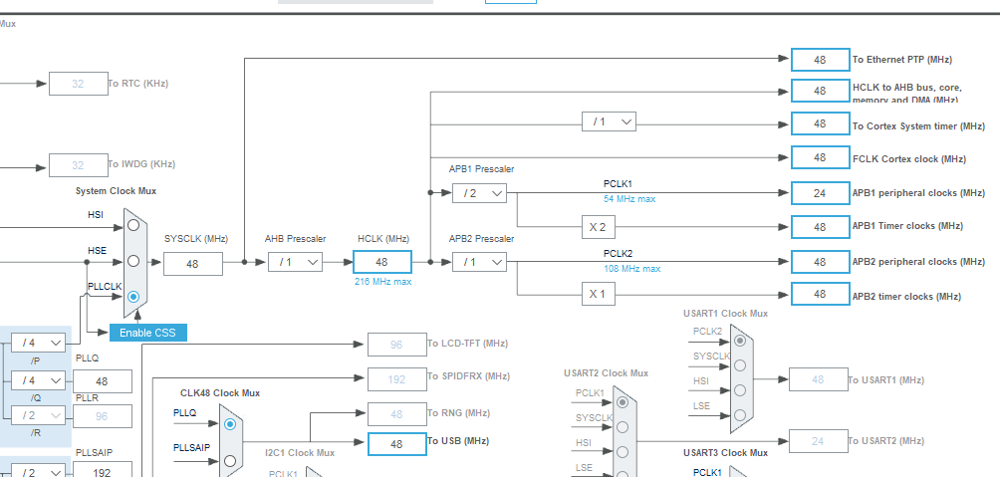
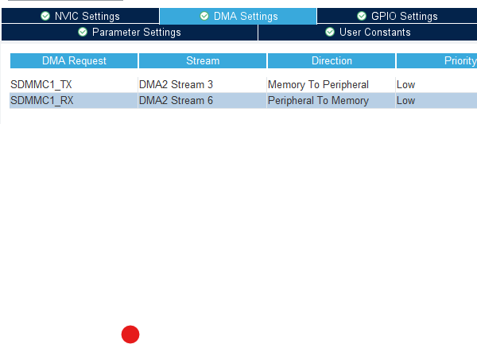
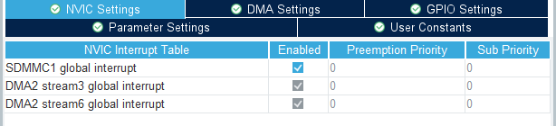
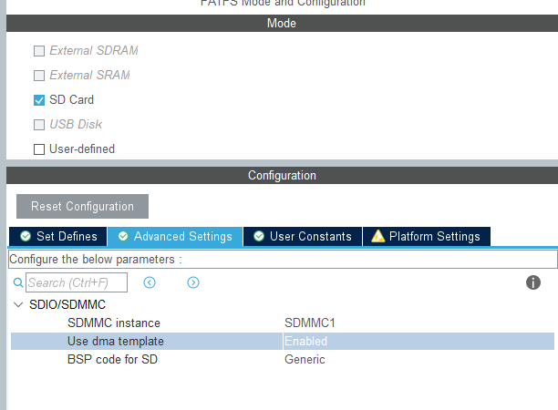

SDIO(Secure Digital Input Output)는 SD 카드 슬롯을 통해 단순한 데이터 저장뿐 아니라 무선 LAN, GPS, 블루투스 같은 다양한 주변기기와 통신할 수 있게 해주는 인터페이스입니다. 임베디드 시스템에서 특히 많이 활용되며, 드라이버 설치와 초기 설정이 매우 중요합니다.

# 설정 방법

해당 기능 활성화하면 클럭 주사수가 변경이 된다. 

## DMA 방식 사용으로 해당기능 추가

## 인터럽트 설정 추가

## DMA 기능 추가한다
