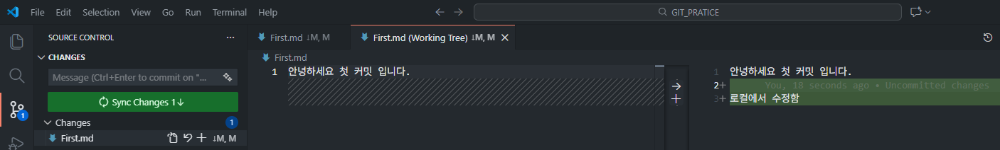
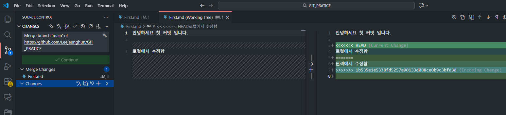
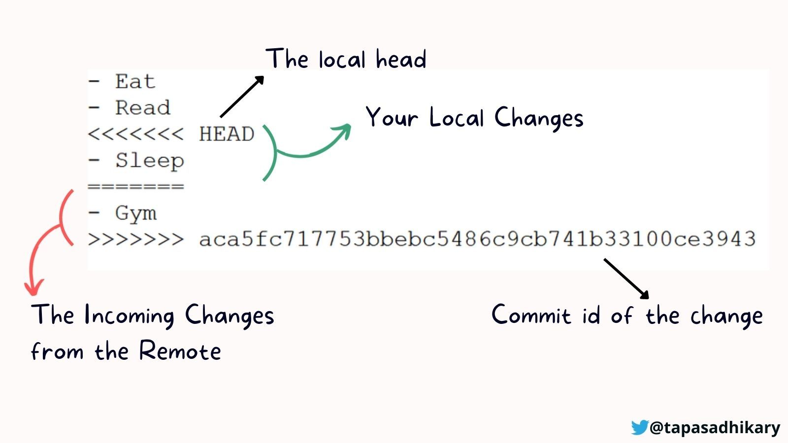

# 참조 
https://learn.microsoft.com/ko-kr/azure/devops/repos/git/gitworkflow?view=azure-devops

2. git 충돌관리
https://www.freecodecamp.org/korean/news/how-to-resolve-merge-conflicts-in-git/


- 기본 명령어 3개만 기억: git add, git commit, git push 

- 해당 명령어도 github Desktop GUI 를 통해 실행 가능

- 다만 git 쓰기가 무서운 이유는 충돌을 관리를 어떻게 해야할지 몰라서 이 글을 쓰면서 테스트 하고 있다.

# 용어 정리

Staging : git 에서 Stagin 이란 커밋하기전 변경된 파일 임시로 저장하는 공간 
- git add 명령으로 변경된 파일을 올려두는 공간


# 버젼관리하는법 테스트

## 샘플 코드 위치 
https://github.com/Leejeunghun/GIT_PRATICE 

# 상황별 반응
1. 원격에서 파일을 수정 하고 로컬에서 다시 수정 한경우

결과 : 동기화 화면이 나옴



해당 결과 스테이징하면 충돌이 확실히 보임


충돌 난 부분 수정하고 스테이징 하면 업로드가 됨
```
<<<<< 
내가 로컬에서 수정한 부분
=====
원격에서 충돌난 부분
>>>>>
```

'


해당 식으로 진행하면 
git 충돌은 1차원적인 경우 해결이 가능하다.