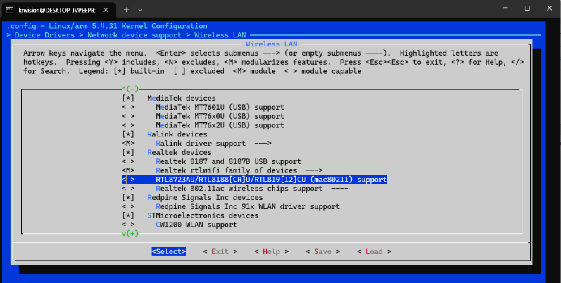

# RTL8723BU USB WiFi 동글을 위한 커널 드라이버 직접 빌드기

MYD-YA157C 보드에 온보드 WiFi(Broadcom BCM43430) 외에 별도 USB WiFi 동글을 추가로 테스트하려다가, 동글이 아예 인식되지 않는 문제를 커널 모듈을 직접 빌드해서 해결한 과정을 기록한다.

---

## 1. 문제 발견: USB 동글은 꽂히는데 인터페이스가 안 생김

`lsusb`가 없는 경량 이미지라 `dmesg`로 USB 이벤트를 직접 확인했다.

```bash
dmesg | tail -30
```

결과에서 USB 재연결 이벤트 직후 이런 로그만 보였다:

```
Bluetooth: hci1: RTL: examining hci_ver=06 hci_rev=000b lmp_ver=06 lmp_subver=8723
Bluetooth: hci1: RTL: loading rtl_bt/rtl8723b_fw.bin
bluetooth hci1: Direct firmware load for rtl_bt/rtl8723b_fw.bin failed with error -2
```

WiFi 인터페이스(`wlan1`)는 전혀 생성되지 않았다. 동글이 **Realtek RTL8723B 계열 WiFi+블루투스 콤보 칩**이라는 건 확인됐지만, 블루투스만 시도하고 WiFi 쪽은 아예 반응이 없었다.

## 2. 원인 진단: 커널에 있는 건 다른 칩군 드라이버

```bash
uname -r
# 5.4.31

ls /lib/modules/5.4.31/kernel/drivers/net/wireless/realtek/
# rtl8192c  rtl8192cu  rtl_usb.ko  rtlwifi.ko
```

커널에 Realtek 드라이버는 있지만 **RTL8192C 계열**이었다. 동글의 칩(RTL8723B)과 다른 제품군이라 매칭이 안 되고, 그래서 `wlan1`이 안 생기는 것으로 확인.

여분의 RTL8192CU 동글로 바꾸면 간단히 해결되지만, 이번엔 이 RTL8723BU 동글을 반드시 써야 하는 상황이라 **커널 모듈을 직접 빌드**하는 방향으로 진행했다.

## 3. 커널 소스 확보 및 설정

MYIR 소스 자료의 `04-Source/MYiR-STM32-kernel.tar.bz2`를 WSL2로 가져와 압축 해제.

```bash
cd ~/work
tar -jxvf MYiR-STM32-kernel.tar.bz2
cd myir-st-linux
source /opt/st/myir/3.1-snapshot/environment-setup-cortexa7t2hf-neon-vfpv4-ostl-linux-gnueabi
mkdir -p ../build
make ARCH=arm O="$PWD/../build" myc-ya157c_defconfig
```

### 3.1 첫 번째 삽질: SDK 환경 오염으로 인한 링커 충돌

```
/opt/st/myir/.../ld: liblto_plugin.so: error loading plugin: .../libc.so.6: version 'GLIBC_2.33' not found
collect2: error: ld returned 1 exit status
```

SDK 환경(`environment-setup`)을 source하면 `ld` 같은 호스트용 도구까지 SDK 안의 낡은 버전으로 잡히는 문제. `which ld`로 확인해보니 실제로 `/opt/st/myir/.../usr/bin/ld`가 선택되고 있었다.

**해결**: PATH 재정렬로 시스템 경로를 우선시키기
```bash
export PATH=/usr/bin:/bin:$PATH
```
크로스컴파일 툴체인은 이름이 고유(`arm-ostl-linux-gnueabi-gcc`)해서 이렇게 재정렬해도 영향 없이 잘 찾아진다.

### 3.2 menuconfig로 드라이버 활성화

```bash
cd ../build
make ARCH=arm O="$PWD" menuconfig
```

경로: `Device Drivers → Network device support → Wireless LAN → Realtek devices → Realtek rtlwifi family of devices → RTL8723AU/RTL8188[CR]U/RTL819[12]CU (mac80211) support`

이 항목이 커널의 통합 `rtl8xxxu` 드라이버였다. 메뉴 이름이 "RTL8723AU"라고 되어있어 우리 칩(RTL8723**B**U)을 지원할지 불확실했지만, 일단 `<M>`으로 활성화하고 진행했다.



## 4. 모듈 빌드 삽질 3연타

### 4.1 잘못된 출력 경로

```
mkdir: cannot create directory '/home/knvision/work/myir-st-linux/build': File exists
```

상대경로(`$PWD/build`) 계산이 현재 디렉터리에 따라 달라져서 설정을 저장했던 실제 빌드 폴더와 다른 곳을 가리킨 것. **절대경로로 통일**해서 해결:
```bash
make ARCH=arm modules -j$(nproc) O=/home/knvision/work/build
```

### 4.2 OpenSSL 헤더 누락

```
scripts/extract-cert.c:21:10: fatal error: openssl/bio.h: No such file or directory
scripts/sign-file.c:25:10: fatal error: openssl/opensslv.h: No such file or directory
```

커널 모듈 서명 관련 호스트 도구가 OpenSSL 개발 헤더를 요구. 설치로 해결:
```bash
sudo apt install -y libssl-dev
```

### 4.3 modules_install 시 파일 누락

```
cp: cannot stat './modules.builtin.modinfo': No such file or directory
```

`make modules`만 하고 `vmlinux` 자체는 안 만들어서, modules_install에 필요한 메타데이터 파일이 없었던 것. vmlinux를 한 번 빌드해서 해결:
```bash
make ARCH=arm vmlinux -j$(nproc) O=/home/knvision/work/build
make ARCH=arm INSTALL_MOD_PATH=/home/knvision/work/build/install_artifact modules_install O=/home/knvision/work/build
```

## 5. 보드 배포 및 최종 테스트

빌드된 모듈을 보드로 복사:
```bash
scp .../rtl8xxxu.ko root@<보드IP>:/lib/modules/5.4.31/kernel/drivers/net/wireless/realtek/rtl8xxxu/
```

보드에서 로드:
```bash
depmod -a
modprobe rtl8xxxu
```

**결과**:
```
usb 2-1: RTL8723BU rev E (SMIC) 1T1R, TX queues 3, WiFi=1, BT=1, GPS=0, HI PA=0
usb 2-1: RTL8723BU MAC: 48:8f:4c:32:a6:ad
usb 2-1: rtl8xxxu: Loading firmware rtlwifi/rtl8723bu_nic.bin
usb 2-1: Direct firmware load for rtlwifi/rtl8723bu_nic.bin failed with error -2
```

칩은 정확히 인식됐지만(**RTL8723BU 확인!**) 이번엔 펌웨어 파일이 없어서 실패. 확인해보니 `/lib/firmware/rtlwifi/rtl8723bu_nic.bin` 파일 자체는 이미 있었는데도 초기엔 실패했었고, `apt install linux-firmware`(혹은 `firmware-realtek`)로 관련 패키지를 재설치한 뒤 재시도하니:

```bash
modprobe -r rtl8xxxu
modprobe rtl8xxxu
ip link show
```

```
5: wlx488f4c32a6ad: <BROADCAST,MULTICAST,UP> ...
    link/ether 48:8f:4c:32:a6:ad
```

**드디어 인터페이스 생성 성공.** MAC 주소가 dmesg에서 확인했던 그 칩과 정확히 일치. 인터페이스 이름이 `wlan1`이 아니라 `wlx488f4c32a6ad`인 건 systemd의 예측 가능한 네트워크 인터페이스 명명 규칙(USB 무선장치는 `wlx+MAC` 형식) 때문이고 정상이다.

이후 온보드 `wlan0`와 동일한 방식(`nmcli`, `iw`)으로 스캔/연결 테스트 진행.

---

## 전체 문제-해결 요약

| 단계 | 증상 | 원인 | 해결 |
|---|---|---|---|
| 초기 진단 | wlan1 안 생김 | 커널에 RTL8192C 드라이버만 있음, RTL8723B와 칩군 불일치 | 커널 모듈 직접 빌드 결정 |
| defconfig | ld 링크 에러 (GLIBC 버전) | SDK 환경 source로 인한 PATH 오염, 낡은 ld 사용 | `export PATH=/usr/bin:/bin:$PATH` |
| modules | mkdir 충돌 | 상대경로 O= 계산 오류 | 절대경로로 통일 |
| modules | openssl 헤더 없음 | 호스트에 libssl-dev 미설치 | `apt install libssl-dev` |
| modules_install | modules.builtin.modinfo 없음 | vmlinux 빌드 안 함 | `make vmlinux` 먼저 실행 |
| modprobe (1차) | 펌웨어 로드 실패 | rtl8723bu_nic.bin 없음/구버전 | `apt install linux-firmware` |
| modprobe (2차) | **성공** | - | `wlx488f4c32a6ad` 인터페이스 생성 확인 |

---

*커널 5.4.31처럼 비교적 최신 버전이라면, 특정 USB 장치용 드라이버가 새로 필요할 때 처음부터 새 드라이버를 이식하기보다 먼저 mainline 커널 소스 안에 이미 있는지(menuconfig에서 검색) 확인하는 게 훨씬 빠른 길이었다. 다만 SDK 환경변수 오염, 호스트 빌드 의존성 누락 같은 부수적인 문제들이 실제 작업 시간의 대부분을 차지했다.*
